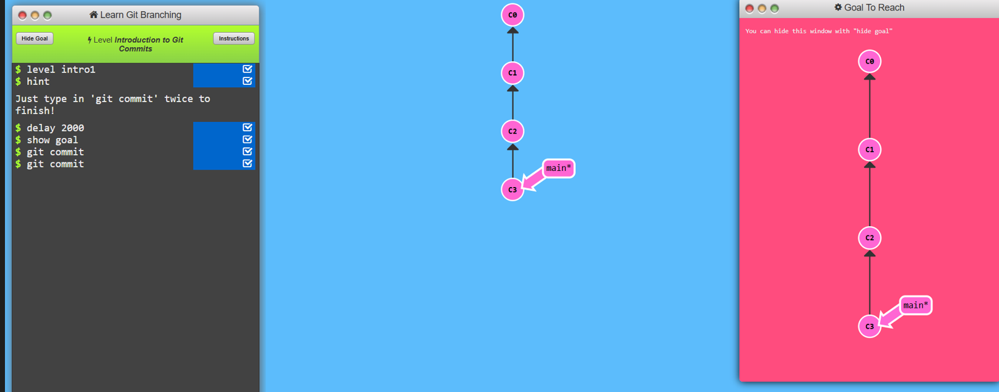
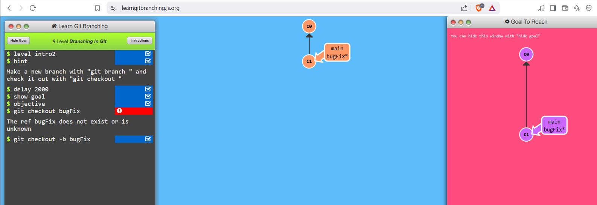
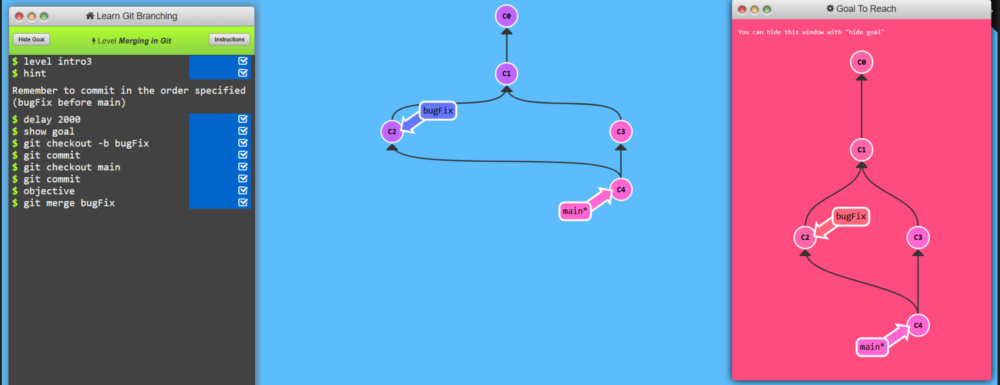
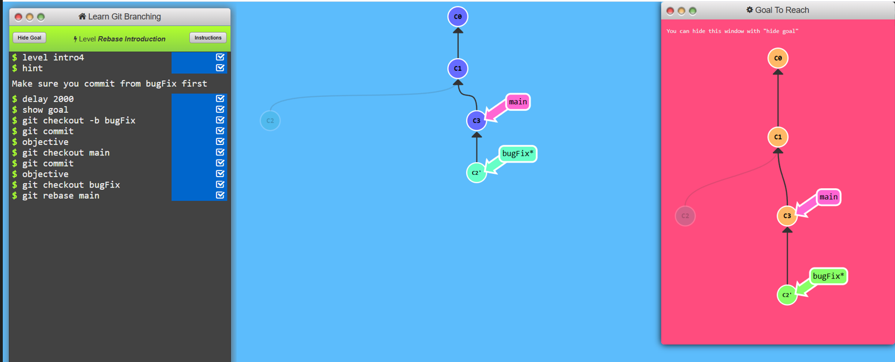
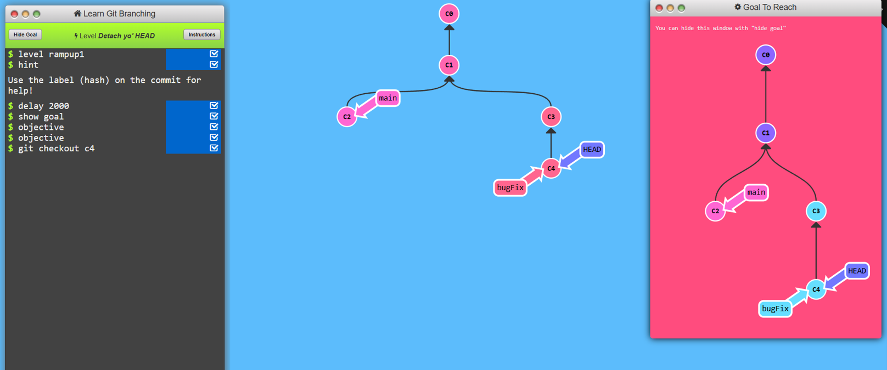
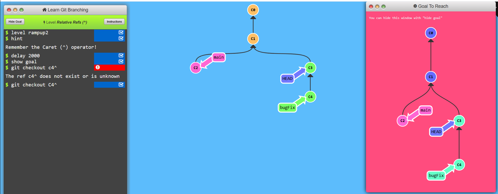
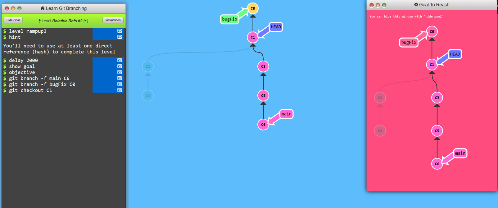
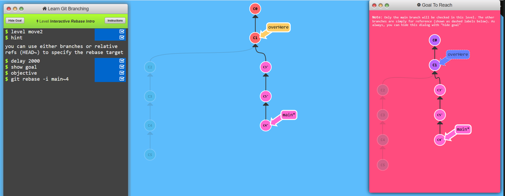
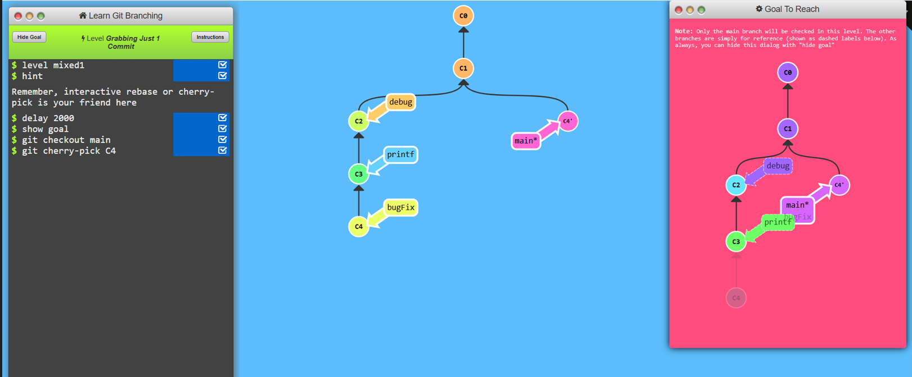

# Learn-Git_Branching

# Level 1

## Task 1
* git commit

## Task 2
* git checkout -b bugFix

## TASK 3
* git checkout -b bugFix
* git commit
* git checkout main
* git commit
* git merge bugfix

## Task 4
* git checkout -b bugfix
* git commit
* git checkout main
* git commit
* git chekout bugfix
* git rebase main

# Level 2

## Task 1

* git checkout c4

## Task 2
* git checkout c4
* git checkout c4^

## Task 3
* git checkout C2~1
* git branch -f main C6
* git branch -f bugFix C1~1

## Task 4
* git reset C3^
* git checkout pushed
* git revert C2

# Level 3

## Task1
* git cherry-pick C3 C4 C7

## Task 2
* git rebase -i C5~4

# Level 4

## Task 1

* git checkout main
* git cherry-pick C4

